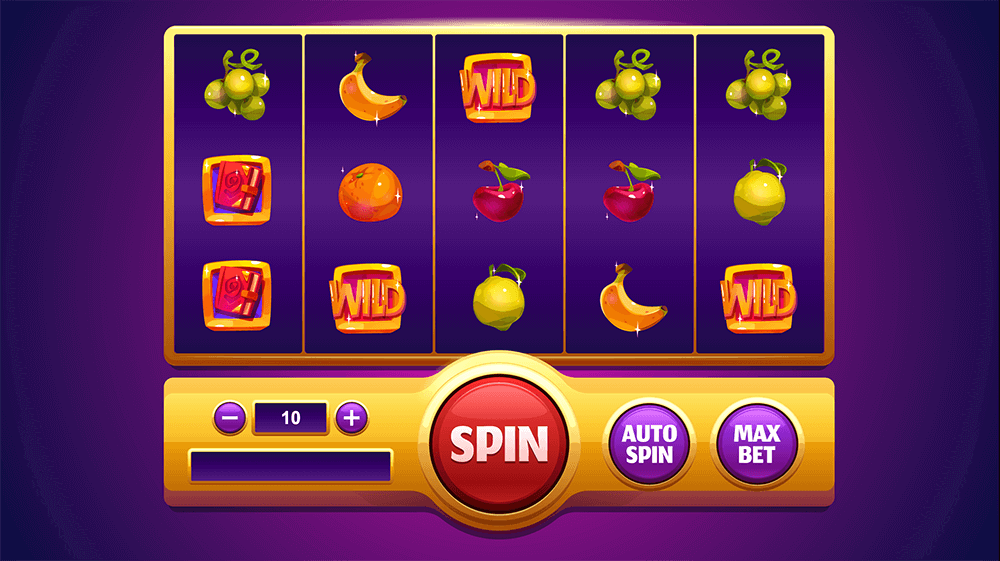

# 老虎機 DEMO

[Demo 連結](https://shezimanor.github.io/slot-game/)

## 遊戲截圖



## 遊戲說明

本遊戲專案使用 `Cocos Creator 3.8.5` 建置。

本遊戲是一款簡易的老虎機遊戲流程演示的遊戲 Demo，純前端演示，定義了 7 條賠付線，與 5 種不同等級的水果，每局都會產生一次隨機結果。

由於是簡易 Demo，所以沒有玩家沒有成本，可以無限制遊玩，每局當動畫跑完會即時顯示當局結果，包含中獎水果的顯目顯示，與當局的總獎勵。

玩家可以修改每局的注碼，也可以使用「Auto spin」讓遊戲不斷自動執行。

## 遊戲設計

### 7 條賠付線

```
第一條：     第二條：     第三條：     第四條：
⚪️⚪️⚪️⚪️⚪️   🟡🟡🟡🟡🟡    ⚪️⚪️⚪️⚪️⚪️   🟡⚪️⚪️⚪️🟡
🟡🟡🟡🟡🟡   ⚪️⚪️⚪️⚪️⚪️    ⚪️⚪️⚪️⚪️⚪️   ⚪️🟡⚪️🟡⚪️
⚪️⚪️⚪️⚪️⚪️   ⚪️⚪️⚪️⚪️⚪️    🟡🟡🟡🟡🟡   ⚪️⚪️🟡⚪️⚪️
第五條：     第六條：     第七條：
⚪️⚪️🟡⚪️⚪️   ⚪️🟡⚪️⚪️⚪️    ⚪️⚪️⚪️🟡⚪️
⚪️🟡⚪️🟡⚪️   🟡⚪️🟡⚪️🟡    🟡⚪️🟡⚪️🟡
🟡⚪️⚪️⚪️🟡   ⚪️⚪️⚪️🟡⚪️    ⚪️🟡⚪️⚪️⚪️
```
